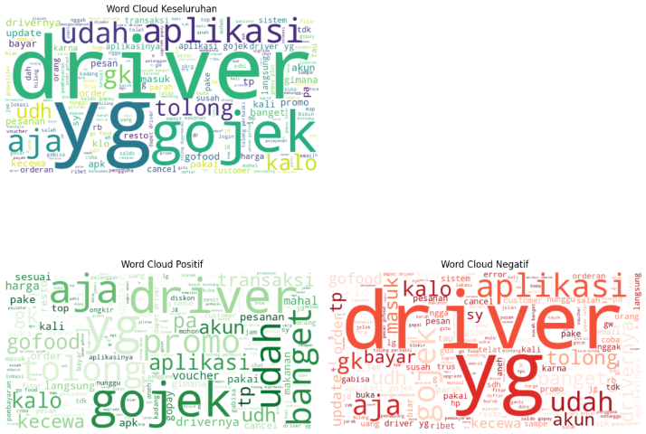

<h1>👋 Halo! Saya Yorrissiagian</h1>

  

Fresh graduate yang fokus pada pengembangan sistem AI & Machine Learning end-to-end. Berikut adalah kumpulan proyek yang pernah saya kerjakan.

<h2>💼 Tentang Saya</h2>
<blockquote>
  Lulusan Teknik Informatika dari Universitas Medan Area dengan minat kuat dalam membangun solusi AI yang berdampak. 
  Fokus: Data preprocessing, modeling, deployment & monitoring model ML. 
  Tools favorit: Python, scikit-learn, TensorFlow, Streamlit, MLflow, Prometheus, Metabase, Docker.
</blockquote>

<h2>🚀 Proyek Saya</h2>

<!-- Semua proyek ditampilkan di bawah -->

### 🌾 Deteksi Penyakit Tanaman Pertanian

  
Laskar AI x Dicoding

  <h3><a href="https://github.com/Capstone-LAI25-SM015/Capstone_Project_LAI25" target="_blank">Deteksi Penyakit Tanaman</a></h3>
  
Proyek Computer Vision berbasis MobileNetV1 untuk mendeteksi penyakit tanaman. Dideploy dengan Streamlit.

  
<strong>Peran:</strong> Pemimpin tim, pengujian model, deployment.

  

    Classification
    Streamlit
    MobileNetV1
  

  
<a href="https://deteksipenyakittanaman.streamlit.app/" target="_blank">🔗 Lihat Demo</a>

### 🎓 Prediksi Dropout Mahasiswa

  
Laskar AI x Dicoding

  <h3><a href="https://github.com/Yorrissiagian/Prediksi-Dropout-Mahasiswa" target="_blank">Prediksi Dropout Mahasiswa</a></h3>
  
Model Random Forest untuk mendeteksi risiko dropout mahasiswa. Dilengkapi dashboard Metabase & aplikasi Streamlit.

  

    Classification
    Metabase
    Random Forest
  

  
<a href="https://jayajayainstitut-k75cbyntzam6qn66aabwtv.streamlit.app/" target="_blank">🔗 Lihat Demo</a>

### 🧑‍💼 Analisis Attrition Human Resources

  
Laskar AI x Dicoding

  <h3><a href="https://github.com/Yorrissiagian/Permasalahan-Human-Resources" target="_blank">Attrition Analysis - Jaya Jaya Maju</a></h3>
  
Model Logistic Regression untuk menganalisis penyebab tingginya attrition. Dashboard dibuat menggunakan Metabase.

  

    HR Analytics
    Logistic Regression
    Metabase
  

### 🖼 Klasifikasi Gambar Daun Tomat

  
Laskar AI x Dicoding

  <h3><a href="https://github.com/Yorrissiagian/Proyek-Klasifikasi-Gambar" target="_blank">Klasifikasi Penyakit Daun Tomat</a></h3>
  
Menggunakan CNN untuk klasifikasi 10 jenis penyakit daun tomat. Akurasi mencapai 91.2%.

  

    CNN
    Klasifikasi Gambar
    TensorFlow
  

<!-- 🧠 Klasifikasi Wajah Anak Autis -->

  
Skripsi

  <h3><a href="https://ieeexplore.ieee.org/document/10250127" target="_blank">Klasifikasi Wajah Anak Autis Menggunakan SURF dan Boosting</a></h3>
  

    Proyek skripsi yang bertujuan mengembangkan sistem klasifikasi untuk membedakan wajah anak dengan gangguan spektrum autisme (ASD) dan wajah anak normal. 
    Sistem ini memanfaatkan teknik ekstraksi fitur <strong>SURF (Speeded-Up Robust Features)</strong> dan lima varian algoritma <strong>Boosting</strong>.
  

  <h4>🎯 Tujuan</h4>
  <ul>
    <li>Mengklasifikasikan wajah anak autis dan normal secara otomatis berbasis citra.</li>
    <li>Mengevaluasi performa lima algoritma Boosting terhadap fitur citra hasil ekstraksi SURF.</li>
  </ul>

  <h4>📁 Dataset</h4>
  <ul>
    <li>Jumlah gambar: 203 (102 autis, 101 normal)</li>
    <li>Format: .jpg | Sumber: Bundaku Autism Clinic Center</li>
    <li>Rasio split: 80% pelatihan, 20% pengujian</li>
  </ul>

  <h4>⚙️ Metodologi</h4>
  <ul>
    <li>Preprocessing: konversi gambar ke grayscale</li>
    <li>Ekstraksi fitur wajah menggunakan <strong>SURF</strong></li>
    <li>Pelatihan lima model Boosting: AdaBoost, GradientBoost, LightGBM, CatBoost, dan XGBoost</li>
    <li>Evaluasi menggunakan metrik: Accuracy, Precision, Recall, F1-Score, dan F2-Score</li>
  </ul>

  <h4>📊 Hasil Evaluasi</h4>
  <table style="width:100%; border-collapse: collapse; color: #e0e0e0;">
  <thead>
  <tr>
    <th style="padding: 8px; border: 1px solid #555; background-color: #263238; color: #ffffff; font-weight: bold;">Algoritma</th>
    <th style="padding: 8px; border: 1px solid #555; background-color: #263238; color: #ffffff; font-weight: bold;">Akurasi</th>
    <th style="padding: 8px; border: 1px solid #555; background-color: #263238; color: #ffffff; font-weight: bold;">Precision</th>
    <th style="padding: 8px; border: 1px solid #555; background-color: #263238; color: #ffffff; font-weight: bold;">Recall</th>
    <th style="padding: 8px; border: 1px solid #555; background-color: #263238; color: #ffffff; font-weight: bold;">F1-Score</th>
    <th style="padding: 8px; border: 1px solid #555; background-color: #263238; color: #ffffff; font-weight: bold;">F2-Score</th>
  </tr>
</thead>
    <tbody>
      <tr>
        <td style="padding: 8px; border: 1px solid #555;">AdaBoost</td>
        <td style="padding: 8px; border: 1px solid #555;">68.29%</td>
        <td style="padding: 8px; border: 1px solid #555;">69.49%</td>
        <td style="padding: 8px; border: 1px solid #555;">69.02%</td>
        <td style="padding: 8px; border: 1px solid #555;">68.22%</td>
        <td style="padding: 8px; border: 1px solid #555;">68.45%</td>
      </tr>
      <tr style="background-color: #263238;">
        <td style="padding: 8px; border: 1px solid #555;">Gradient Boosting</td>
        <td style="padding: 8px; border: 1px solid #555;">73.17%</td>
        <td style="padding: 8px; border: 1px solid #555;">73.57%</td>
        <td style="padding: 8px; border: 1px solid #555;">73.57%</td>
        <td style="padding: 8px; border: 1px solid #555;">73.17%</td>
        <td style="padding: 8px; border: 1px solid #555;">73.31%</td>
      </tr>
      <tr>
        <td style="padding: 8px; border: 1px solid #555;">LightGBM</td>
        <td style="padding: 8px; border: 1px solid #555;">73.17%</td>
        <td style="padding: 8px; border: 1px solid #555;">73.10%</td>
        <td style="padding: 8px; border: 1px solid #555;">73.21%</td>
        <td style="padding: 8px; border: 1px solid #555;">73.11%</td>
        <td style="padding: 8px; border: 1px solid #555;">73.16%</td>
      </tr>
      <tr style="background-color: #263238;">
        <td style="padding: 8px; border: 1px solid #555;"><strong>CatBoost</strong></td>
        <td style="padding: 8px; border: 1px solid #555;"><strong>80.49%</strong></td>
        <td style="padding: 8px; border: 1px solid #555;"><strong>80.60%</strong></td>
        <td style="padding: 8px; border: 1px solid #555;"><strong>80.74%</strong></td>
        <td style="padding: 8px; border: 1px solid #555;"><strong>80.74%</strong></td>
        <td style="padding: 8px; border: 1px solid #555;"><strong>80.59%</strong></td>
      </tr>
      <tr>
        <td style="padding: 8px; border: 1px solid #555;">XGBoost</td>
        <td style="padding: 8px; border: 1px solid #555;">70.73%</td>
        <td style="padding: 8px; border: 1px solid #555;">70.84%</td>
        <td style="padding: 8px; border: 1px solid #555;">70.93%</td>
        <td style="padding: 8px; border: 1px solid #555;">70.72%</td>
        <td style="padding: 8px; border: 1px solid #555;">70.80%</td>
      </tr>
    </tbody>
  </table>

  <h4>📌 Kesimpulan</h4>
  

    Proyek ini menunjukkan bahwa kombinasi metode <strong>SURF + Boosting</strong> mampu membedakan wajah anak autis dan wajah normal secara efektif. 
    Algoritma <strong>CatBoost</strong> menjadi yang paling akurat dengan nilai F1-score dan F2-score di atas 80%.
    Studi ini membuka peluang untuk pengembangan sistem diagnosis awal berbasis pengenalan wajah anak.
  

  

    SURF
    Boosting
    Autism Detection
    Machine Learning
  

  
<a href="https://ieeexplore.ieee.org/document/10250127" target="_blank">📄 Lihat Publikasi IEEE</a>

<!-- 📱 Analisis Sentimen Review Gojek -->

  
Laskar AI x Dicoding

  <h3>Analisis Sentimen</h3>
    

    <a href="https://github.com/Yorrissiagian/Proyek-Analisis-Sentimen" class="button" target="_blank">
      🔗 Lihat Proyek Lengkap di GitHub
    </a>
  

  

    Submission proyek kelas <strong>"Belajar Fundamental Deep Learning"</strong> yang berfokus pada analisis sentimen terhadap review aplikasi Gojek dari Google Play Store. 
    Proyek ini mencakup scraping, preprocessing teks, labeling sentimen berbasis lexicon, visualisasi, dan klasifikasi menggunakan <strong>MLPClassifier</strong>.
  

  <ul>
    <li>Scraping 10.000 review aplikasi com.gojek.app menggunakan <strong>google-play-scraper</strong></li>
    <li>Preprocessing teks: slang correction, tokenization, stopword removal, stemming</li>
    <li>Labeling sentimen berbasis <strong>lexicon-positive</strong> dan <strong>lexicon-negative</strong></li>
    <li>Model klasifikasi: <strong>MLPClassifier</strong> dengan akurasi testing 92.14%</li>
  </ul>

  

    
    

      <strong>Distribusi Sentimen:</strong> Pie chart menunjukkan bahwa sebagian besar review bernada positif, dengan proporsi signifikan dari review negatif. 
      Ini menjadi dasar evaluasi performa model klasifikasi selanjutnya.
    

  

  

    
    

      <strong>WordCloud:</strong> Visualisasi kata-kata yang paling sering muncul dalam review pengguna aplikasi Gojek. Kata "gojek", "driver", dan "layanan" termasuk yang paling dominan.
    

  

  <h4>📈 Evaluasi Model Klasifikasi (MLPClassifier)</h4>
  <ul>
    <li><strong>Akurasi Training:</strong> 98.11%</li>
    <li><strong>Akurasi Testing:</strong> 92.14%</li>
  </ul>
  <pre style="background-color:#1e1e1e; padding:1rem; border-radius:10px; color:#cfd8dc;">
Classification Report (Testing - MLP):

              precision    recall  f1-score   support

           0       0.93      0.94      0.94      3966
           1       0.90      0.89      0.90      2471

    accuracy                           0.92      6437
   macro avg       0.92      0.92      0.92      6437
weighted avg       0.92      0.92      0.92      6437
  </pre>

  <h4>📌 Hasil & Insight</h4>
  

    Dataset review Gojek berhasil dikumpulkan dan diproses menggunakan pipeline teks lengkap. Labeling berbasis lexicon memberikan dasar yang kuat untuk supervised learning.
    WordCloud memperlihatkan kata-kata kunci pengguna, dan model <strong>MLPClassifier</strong> berhasil mengklasifikasikan review dengan akurasi tinggi. 
    Hal ini menunjukkan bahwa pendekatan sederhana namun terstruktur dapat menghasilkan model NLP yang <strong>efektif dan dapat diandalkan</strong>.
  

  

    NLP
    Sentiment Analysis
    Lexicon-Based
    MLPClassifier
  

<!-- 🏗 Membangun Proyek ML Terintegrasi -->

  
Laskar AI x Dicoding

  <h3>Membangun Proyek Machine Learning</h3>
  

    <a href="https://github.com/Yorrissiagian/Membangun-proyek-ML" class="button" target="_blank">
      🔗 Lihat Proyek Lengkap di GitHub
    </a>
  

  

    Submission akhir kelas <strong>"Membangun Proyek Machine Learning"</strong> yang terdiri dari dua bagian:
    Clustering pengeluaran masyarakat & Klasifikasi berdasarkan hasil klaster.
  

  <!-- 🔷 Clustering -->
  <h4>🔷 Clustering: Segmentasi Masyarakat Berdasarkan Pengeluaran</h4>
  <ul>
    <li>Algoritma: KMeans (3 klaster) dengan PowerTransformer</li>
    <li>Evaluasi jumlah cluster menggunakan Inertia & Silhouette Score</li>
    <li>Analisis distribusi pengeluaran untuk mengidentifikasi skewness & outlier</li>
    <li>Segmentasi masyarakat berdasarkan pola pengeluaran tahunan</li>
  </ul>

  

    
    

      <strong>Distribusi Pengeluaran:</strong> Histogram ini menunjukkan bahwa sebagian besar masyarakat memiliki
      pengeluaran rendah, dengan kehadiran outlier yang signifikan. Visual ini mendasari keputusan untuk melakukan
      transformasi data sebelum clustering.
    

  

  

    
    

      <strong>Evaluasi Jumlah Cluster:</strong> Metode Elbow dan Silhouette Score digunakan untuk menentukan jumlah klaster optimal.
      Hasil menunjukkan bahwa 3 klaster memberikan pemisahan terbaik antar segmen masyarakat.
    

  

  <!-- 🔶 Klasifikasi -->
  <h4>🔶 Klasifikasi: Prediksi Segmentasi Masyarakat</h4>
  <ul>
    <li>Model: Logistic Regression & KNN</li>
    <li>Evaluasi akurasi dan F1-score mencapai >99%</li>
    <li>Hyperparameter tuning: GridSearchCV & RandomizedSearchCV</li>
    <li>Visualisasi: Confusion matrix dan learning curve untuk analisis performa</li>
  </ul>

  

    

      
      

        <strong>Confusion Matrix (Logistic Regression):</strong> Model berhasil mengklasifikasikan setiap kelas dengan sangat akurat, hampir tanpa kesalahan.
      

    

    

      
      

        <strong>Confusion Matrix (KNN):</strong> Performa tinggi secara umum, meski sedikit lebih rendah pada kelas minoritas dibanding Logistic Regression.
      

    

  

  

    

      
      

        <strong>Learning Curve (Logistic Regression):</strong> Kurva training dan validation yang mendekat menunjukkan model general dan tidak overfit.
      

    

    

      
      

        <strong>Learning Curve (KNN):</strong> Kinerja stabil dengan sedikit variasi, menunjukkan model cukup fleksibel terhadap perubahan data.
      

    

  

  <!-- 📌 Hasil & Kesimpulan -->
  <h4>📌 Hasil & Kesimpulan</h4>
  

    

      Proyek ini berhasil melakukan segmentasi terhadap masyarakat Indonesia berdasarkan pola pengeluaran tahunan menggunakan algoritma
      <strong>KMeans clustering</strong>. Analisis dan visualisasi evaluasi menunjukkan bahwa
      <strong>3 klaster</strong> merupakan jumlah optimal, masing-masing dengan karakteristik pengeluaran yang berbeda-beda.
      Preprocessing menggunakan <strong>PowerTransformer</strong> berhasil menormalkan distribusi data yang awalnya sangat skewed.
    

    

      Hasil klaster kemudian digunakan sebagai label target dalam proses klasifikasi.
      Dua model utama, yaitu <strong>Logistic Regression</strong> dan <strong>K-Nearest Neighbors (KNN)</strong>,
      berhasil dibangun dengan hasil yang sangat baik. Evaluasi model menunjukkan
      <strong>F1-score di atas 99%</strong>, serta confusion matrix yang mendekati sempurna untuk seluruh kelas.
    

    

      Selain itu, <strong>learning curve</strong> dari kedua model menunjukkan performa yang stabil
      dan tidak terjadi overfitting maupun underfitting yang signifikan. Hal ini menandakan bahwa
      pipeline machine learning yang dibangun—dari tahap eksplorasi, preprocessing, segmentasi, hingga klasifikasi—
      telah berjalan efektif dan menghasilkan sistem prediksi yang <strong>akurat, stabil, dan dapat direproduksi</strong>.
    

  

  

    MLOps
    Clustering
    Classification
    Tuning
  

<h2>📣 Kontak Saya</h2>
<ul>
  <li>📧 Email: yorrissiagian6@email.com</li>
  <li>💼 LinkedIn: <a href="https://linkedin.com/in/yorris-siagian-9a4756243" target="_blank">linkedin.com/in/yorris-siagian-9a4756243</a></li>
  <li>👥 GitHub: <a href="https://github.com/Yorrissiagian" target="_blank">github.com/Yorrissiagian</a></li>
</ul>

<blockquote>
  Terakhir diperbarui: {{ "now" | date: "%d %B %Y" }}
</blockquote>
